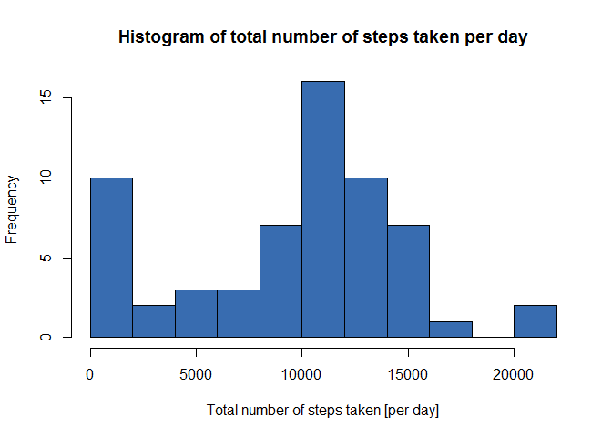
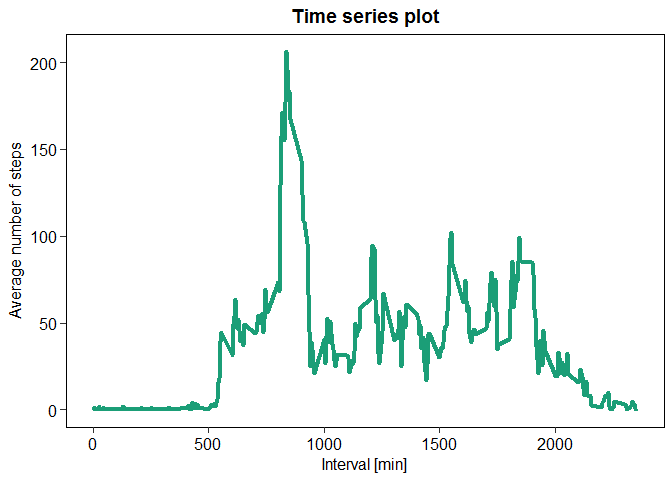
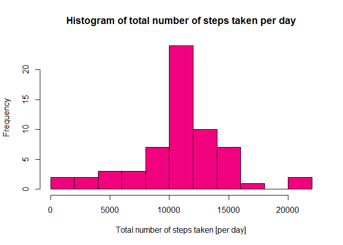
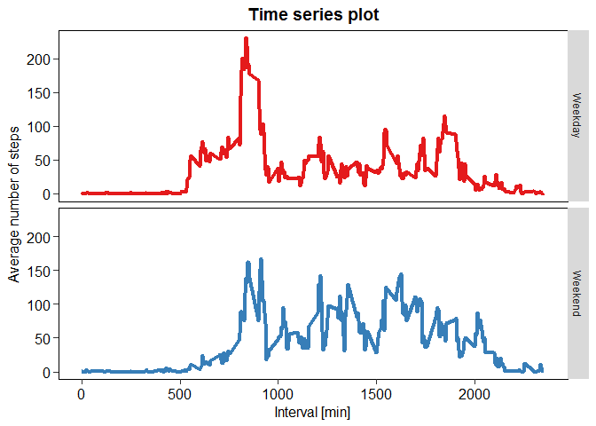

# Reproducible Research: Peer Assessment 1


## Loading and preprocessing the data

#### Downloading the required libraries:

```r
library(knitr)
library(dplyr)
library(ggplot2)
```

#### Reading the data into R and looking at the first few lines:

```r
setwd("D:/Data Science/Course 5/Week 2/RepData_PeerAssessment1")
unzip("activity.zip")
dat <- read.csv("activity.csv")
head(dat)
```

```
##   steps       date interval
## 1    NA 2012-10-01        0
## 2    NA 2012-10-01        5
## 3    NA 2012-10-01       10
## 4    NA 2012-10-01       15
## 5    NA 2012-10-01       20
## 6    NA 2012-10-01       25
```

#### Defining the 'date' column as a date variable:

```r
dat$date <- as.POSIXct(strptime(as.character(dat$date),format = "%Y-%m-%d"))
str(dat)
```

```
## 'data.frame':	17568 obs. of  3 variables:
##  $ steps   : int  NA NA NA NA NA NA NA NA NA NA ...
##  $ date    : POSIXct, format: "2012-10-01" "2012-10-01" ...
##  $ interval: int  0 5 10 15 20 25 30 35 40 45 ...
```

## What is mean total number of steps taken per day?

#### Calculating the total number of steps taken per day:

```r
tot_step <- dat %>% group_by(date) %>% summarise(total.steps = sum(steps,na.rm = TRUE))
tot_step
```

```
## # A tibble: 61 x 2
##          date total.steps
##        <dttm>       <int>
##  1 2012-10-01           0
##  2 2012-10-02         126
##  3 2012-10-03       11352
##  4 2012-10-04       12116
##  5 2012-10-05       13294
##  6 2012-10-06       15420
##  7 2012-10-07       11015
##  8 2012-10-08           0
##  9 2012-10-09       12811
## 10 2012-10-10        9900
## # ... with 51 more rows
```

#### Creating a histogram of total number of steps per day:

```r
with(tot_step,hist(total.steps,breaks = 10,col="#386cb0",xlab = "Total number of steps taken [per day]",
                   main = "Histogram of total number of steps taken per day"))
```

<!-- -->

```r
dev.copy(png,"Figures/Total number of steps.png", width=480, height=480)
```

```
## png 
##   3
```

```r
dev.off()
```

```
## png 
##   2
```

#### Calculating the mean and median of total steps per day:

```r
mea <- round(mean(tot_step$total.steps),2)
med <- median(tot_step$total.steps)
```

* The mean total number of steps taken per day is: 9354.23
* The median of the total number of steps taken per day is: 10395

## What is the average daily activity pattern?

#### Calculating the average number of steps per interval accross all days
#### And then generating a time series plot of the average steps per interval:

```r
ave_dat <- dat %>% group_by(interval) %>% summarise(mean.steps = mean(steps,na.rm = TRUE))
ave_dat <- data.frame(ave_dat)
p <- ggplot(ave_dat,aes(x = interval,y = mean.steps)) +
     geom_line(col = "#1b9e77",size = 1.5) +
     xlab("Interval [min]") +
     ylab("Average number of steps") +
     ggtitle("Time series plot") +
     theme(panel.background = element_blank(),
           panel.border = element_rect(size=0.5,colour = "black",fill = NA),
           panel.grid.major.x = element_blank(),
           panel.grid.major.y = element_blank(),
           axis.text = element_text(size=12,colour="black"),
           axis.title = element_text(size=12,colour = "black"),
           axis.ticks = element_line(size=0.5),
           axis.ticks.length = unit(.15, "cm"),
           plot.title = element_text(face="bold",size = 14, colour = "black",hjust = 0.5))
p
```

<!-- -->

```r
dev.copy(png,"Figures/Average number of steps per interval.png", width=480, height=480)
```

```
## png 
##   3
```

```r
dev.off()
```

```
## png 
##   2
```

#### Finding the 5 minute interval with the maximum number of steps:

```r
max_int <- ave_dat$interval[which(ave_dat$mean.steps==max(ave_dat$mean.steps))]
```

* The interval with the maximum number of steps across all day is: 835

## Imputing missing values

#### Calculating the total number of missing values in the dataset:

```r
num_na <- sum(is.na(dat$steps))
```

* The total number of missing values in the dataset is: 2304

#### Imputing the missing values in data by replacing them with
#### the mean of the 5 minute intervals and assigning new dataset to 'new_dat':

```r
impute.mean <- function(x) replace(x, is.na(x), mean(x, na.rm = TRUE))
new_dat <- dat %>% group_by(interval) %>% mutate(steps = impute.mean(steps))
summary(new_dat)
```

```
##      steps             date                        interval     
##  Min.   :  0.00   Min.   :2012-10-01 00:00:00   Min.   :   0.0  
##  1st Qu.:  0.00   1st Qu.:2012-10-16 00:00:00   1st Qu.: 588.8  
##  Median :  0.00   Median :2012-10-31 00:00:00   Median :1177.5  
##  Mean   : 37.38   Mean   :2012-10-31 00:25:34   Mean   :1177.5  
##  3rd Qu.: 27.00   3rd Qu.:2012-11-15 00:00:00   3rd Qu.:1766.2  
##  Max.   :806.00   Max.   :2012-11-30 00:00:00   Max.   :2355.0
```

#### Calculating the total number of steps taken per day:

```r
tot.step <- new_dat %>% group_by(date) %>% summarise(total.steps = sum(steps,na.rm = TRUE))
tot.step
```

```
## # A tibble: 61 x 2
##          date total.steps
##        <dttm>       <dbl>
##  1 2012-10-01    10766.19
##  2 2012-10-02      126.00
##  3 2012-10-03    11352.00
##  4 2012-10-04    12116.00
##  5 2012-10-05    13294.00
##  6 2012-10-06    15420.00
##  7 2012-10-07    11015.00
##  8 2012-10-08    10766.19
##  9 2012-10-09    12811.00
## 10 2012-10-10     9900.00
## # ... with 51 more rows
```

#### Creating a histogram of total number of steps per day:

```r
with(tot.step,hist(total.steps,breaks = 10,col="#f0027f",xlab = "Total number of steps taken [per day]",
                   main = "Histogram of total number of steps taken per day"))
```

<!-- -->

```r
dev.copy(png,"Figures/Total number of steps without NA.png", width=480, height=480)
```

```
## png 
##   3
```

```r
dev.off()
```

```
## png 
##   2
```

#### Calculating the mean and median of total steps per day:

```r
m1 <- round(mean(tot.step$total.steps)/1000,3)
m2 <- round(median(tot.step$total.steps)/1000,3)
```

* The mean total number of steps taken per day is [in thousands]: 10.766
* The median of the total number of steps taken per day is [in thousands]: 10.766

## Are there differences in activity patterns between weekdays and weekends?

#### Creating a factor of weekdays versus weekends:

```r
new_dat$day <- character(nrow(new_dat))
new_dat$day[(weekdays(new_dat$date) %in% c("Saturday","Sunday"))] <- "Weekend"
new_dat$day[!(weekdays(new_dat$date) %in% c("Saturday","Sunday"))] <- "Weekday"
new_dat$day <- factor(new_dat$day)
head(new_dat)
```

```
## # A tibble: 6 x 4
## # Groups:   interval [6]
##       steps       date interval     day
##       <dbl>     <dttm>    <int>  <fctr>
## 1 1.7169811 2012-10-01        0 Weekday
## 2 0.3396226 2012-10-01        5 Weekday
## 3 0.1320755 2012-10-01       10 Weekday
## 4 0.1509434 2012-10-01       15 Weekday
## 5 0.0754717 2012-10-01       20 Weekday
## 6 2.0943396 2012-10-01       25 Weekday
```

#### Creating a panel plot of average number of steps per interval

```r
ave.dat <- new_dat %>%
    group_by(day,interval) %>%
    summarise(mean.steps = mean(steps,na.rm = TRUE))
ave.dat
```

```
## # A tibble: 576 x 3
## # Groups:   day [?]
##        day interval mean.steps
##     <fctr>    <int>      <dbl>
##  1 Weekday        0 2.25115304
##  2 Weekday        5 0.44528302
##  3 Weekday       10 0.17316562
##  4 Weekday       15 0.19790356
##  5 Weekday       20 0.09895178
##  6 Weekday       25 1.59035639
##  7 Weekday       30 0.69266247
##  8 Weekday       35 1.13794549
##  9 Weekday       40 0.00000000
## 10 Weekday       45 1.79622642
## # ... with 566 more rows
```

```r
p <- ggplot(ave.dat,aes(x = interval,y = mean.steps,color = day)) +
     geom_line(size = 1.5) +
     xlab("Interval [min]") +
     ylab("Average number of steps") +
     ggtitle("Time series plot") +
     scale_colour_manual(values = c('#e41a1c','#377eb8')) +
     theme(panel.background = element_blank(),
           panel.border = element_rect(size=0.5,colour = "black",fill = NA),
           panel.grid.major.x = element_blank(),
           panel.grid.major.y = element_blank(),
           axis.text = element_text(size=12,colour="black"),
           axis.title = element_text(size=12,colour = "black"),
           axis.ticks = element_line(size=0.5),
           axis.ticks.length = unit(.15, "cm"),
           plot.title = element_text(face="bold",size = 14, colour = "black",hjust = 0.5),
           legend.position = "n")
p + facet_grid(day ~ .)
```

<!-- -->

```r
dev.copy(png,"Figures/Panel plot.png", width=480, height=480)
```

```
## png 
##   3
```

```r
dev.off()
```

```
## png 
##   2
```
